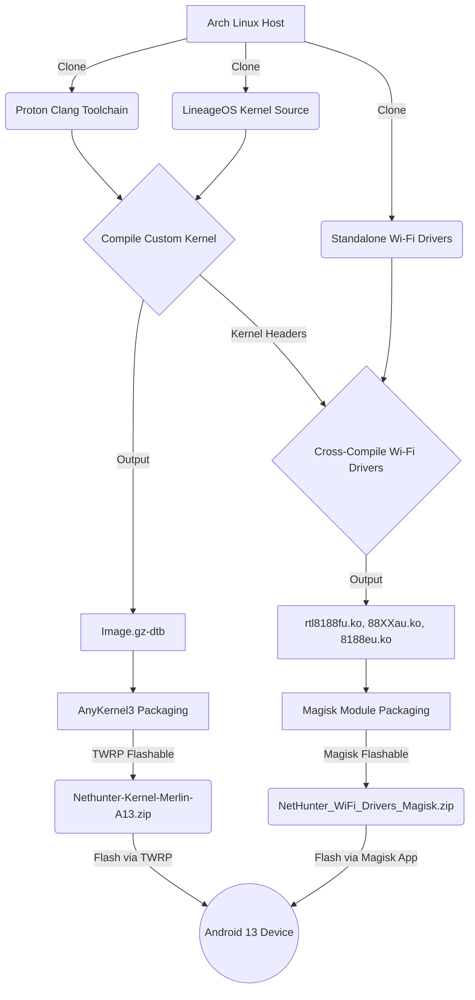

# NetHunter Custom Kernel & Wi-Fi Arsenal (Redmi Note 9 - Merlin)


Welcome to the definitive Kali NetHunter kernel compilation project for the **Redmi Note 9 (merlin / merlinx)** running Android 13 (LineageOS 20).

This repository is designed to be the ultimate starting point for anyone who wants to compile a NetHunter kernel from scratch and securely inject fully weaponized Wi-Fi drivers for packet injection and monitor mode via Magisk.

## 🚀 Features Enabled
- **Kali NetHunter Core:** Fully compatible with the NetHunter app and chroot.
- **HID Attacks:** Rubber Ducky (`CONFIG_USB_CONFIGFS_F_HID=y`) and `CONFIG_HIDRAW=y`.
- **Mass Storage:** DriveDroid support (`CONFIG_USB_CONFIGFS_MASS_STORAGE=y`).
- **Bluetooth Attacks:** HCI UART and USB (`CONFIG_BT_HCIUSB=m`).
- **External Wi-Fi Injection:** Three custom-compiled out-of-tree Realtek drivers injected systemlessly on boot.

## 📡 Supported Wi-Fi Adapters
| Adapter | Chipset | Interface | Driver Used | Status |
|---|---|---|---|---|
| TP-Link TL-WN722N (v2/v3) | RTL8188EUS | wlan2 | aircrack-ng/rtl8188eus | Working (Injection/Monitor) |
| TP-Link Archer T2U Plus | RTL8821AU | wlan2 | aircrack-ng/rtl8812au | Working (Injection/Monitor) |
| Generic Micro Wi-Fi | RTL8188FTV | wlan2 | kelebek333/rtl8188fu | Working (Injection/Monitor) |

## 🏗️ Architecture & Workflow



## 📖 Documentation
Head over to the `docs/` directory for full step-by-step guides on recreating this exact build:
- [Kernel Build Guide](docs/Kernel_Build_Guide.md) - Learn how to compile the kernel and fix Clang compiler errors.
- [Driver Build Guide](docs/Driver_Build_Guide.md) - Learn how to patch driver source code to compile flawlessly on Android.
- [Magisk Module Generation](docs/Magisk_Module.md) - Learn how the systemless auto-boot module was made.
- [Troubleshooting & Tricks](docs/Troubleshooting.md) - The secret to putting Realtek drivers in Monitor Mode without crashing.

## 🛠️ Usage
All build scripts are available in the `tools/` directory. If you have your dependencies (`libelf`, `bison`, `python3`) setup, you can simply run:
```bash
bash tools/build_kernel.sh
bash tools/build_modules.sh
bash tools/package_kernel.sh
bash tools/package_magisk.sh
```

## 📦 Restoring the Full Workspace Archive
If you downloaded the massive `project_file.zip` chunks from the **GitHub Releases** page instead of cloning, you must fuse them together before unzipping.

Once you have downloaded `project_file.zip.part_aa`, `part_ab`, and `part_ac` into the same folder, open your terminal and run:
```bash
# Combine the split chunks into a single zip file
cat project_file.zip.part_* > complete_project_file.zip

# Unzip the fused file
unzip complete_project_file.zip
```
